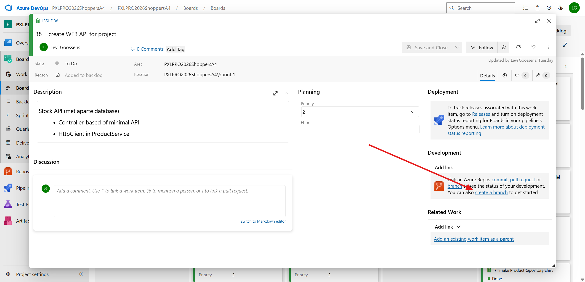
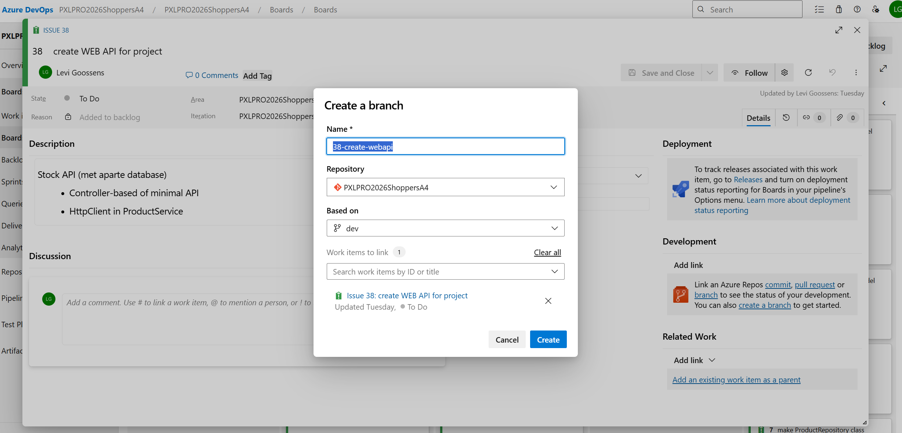

# workflow
guide and rules on how we work together on this codebase.

## Overview
- only _one_ reviewer needed for feature pull requests.
- minimum _two_ reviewers needed for dev to main.
- changes that are merged to main work without any direct unexpected problems.

## rules (try to follow as best as possible)
these rules can apply to the developer and/or the reviewer of the code.

### Feature branch and Pull Request
1. always push your changes.
	- Commit regularly and push your work to the remote repository.
2. make a new branch on azure devops for your issue. (this is more clear in azure devops)
	- When starting work on an issue, create a dedicated branch for it.
	- example for this case: `38-create-web-api`
	- See the screenshots below for more info.

3. only try to make changes related to your issue. (this is to minimize conflicts with others, and avoid double work)
4. Push your branch and open a PR to the dev branch.
5. Request a review before merging
	- At least _one_ team member should review this PR.
	- Address any feedback before merging. with a comment, a code fix, a wont fix or some other agreement.
6. Make sure the project still builds/runs {reviewer/developer}
	- Test the changes locally before pushing or merging.
	- Try to check existing functionality is not broken.

### merge dev branch to main branch
> [!CAUTION]  
> merging or making changes on main is what will go into production.  
> so if the main has bugs, or mistakes these will go into production.  
> and may cause trouble, damage or disruption there.  
> (just something to keep in mind, expecialy in the future at work)

1. make pull request
2. test code on current dev branch (docker-compose)
3. _two_ team members have tested dev branch and confirmed everything works
4. do merge
5. check if main is still working